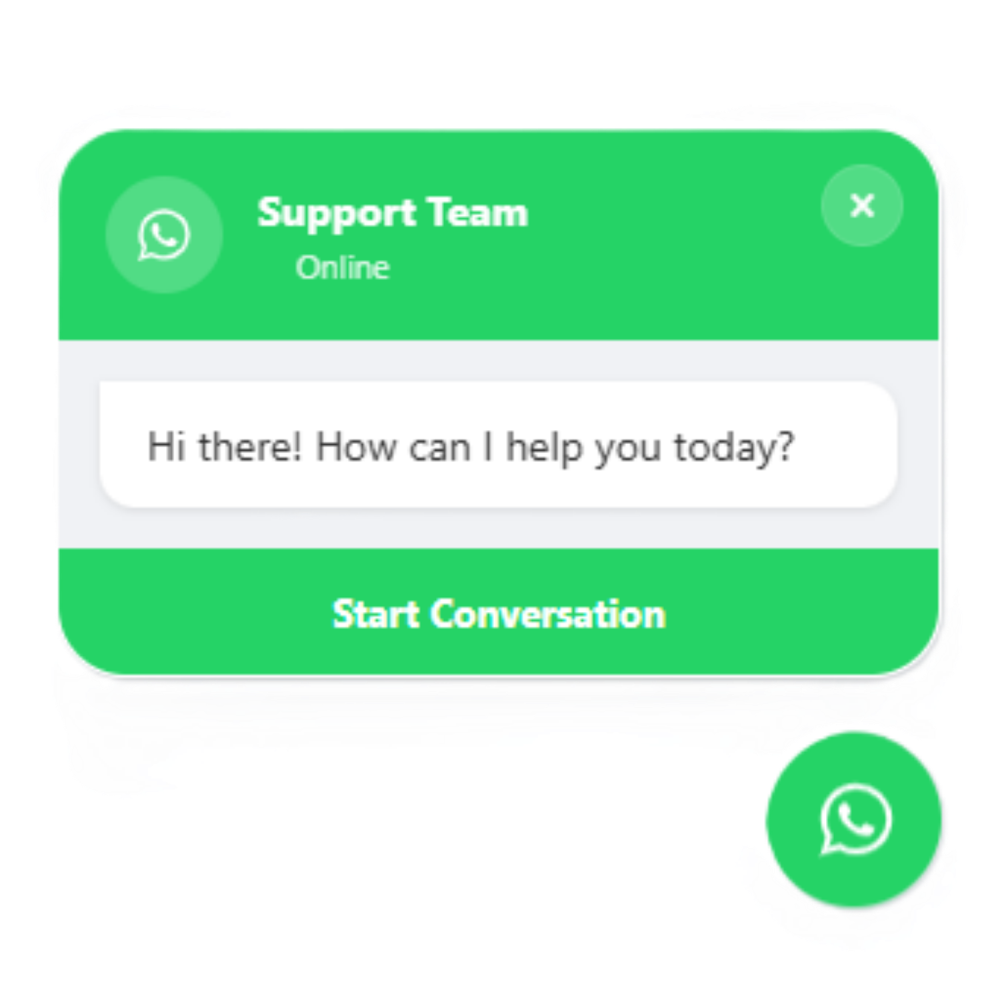

# WhatsApp Floating Button

A professional, high-performance floating WhatsApp button plugin for WordPress. Designed for modern websites that prioritize user experience and premium aesthetics.

  

## Features

### Premium UI/UX
- **Glassmorphism Design:** Implements modern "glass" effects with backdrop blur for a sophisticated look.
- **Interactive Chat Bubble:** Automated popup with a realistic typing indicator to engage visitors.
- **Advanced Animations:** Gentle floating animations and a blinking "Online" status indicator.

### Full Customization
- **Admin Dashboard:** Control colors, positions, sizes, and labels directly from the WordPress settings.
- **Live Preview:** View configuration changes in real-time within the admin area.
- **Business Hours:** Schedule button visibility based on operational hours.
- **Analytics:** Built-in click tracking to monitor user engagement.

### Technical Excellence
- **Security:** Strict input sanitization and output escaping following WordPress best practices.
- **Responsive:** Fully optimized for mobile, tablet, and desktop devices.
- **Accessibility:** Supports system-level motion preferences and follows semantic standards.
- **Shortcode Support:** Easily place the button anywhere using `[whatsapp_button]`.

## Live Demonstration

A live preview of the interface is available on GitHub Pages:
[View Live Demo](https://adeshasur.github.io/WhatsApp-Floating-Button/)

## Installation

1. Download the repository as a ZIP file.
2. In your WordPress Dashboard, navigate to **Plugins > Add New > Upload Plugin**.
3. Select the ZIP file and click **Install Now**.
4. **Activate** the plugin.
5. Go to **Settings > WhatsApp Button** to configure your preferences.

## Developer

Developed by **Adheesha Sooriyaarachchi**.

## License

Distributed under the GNU General Public License v2 or later. See the LICENSE file for more details.